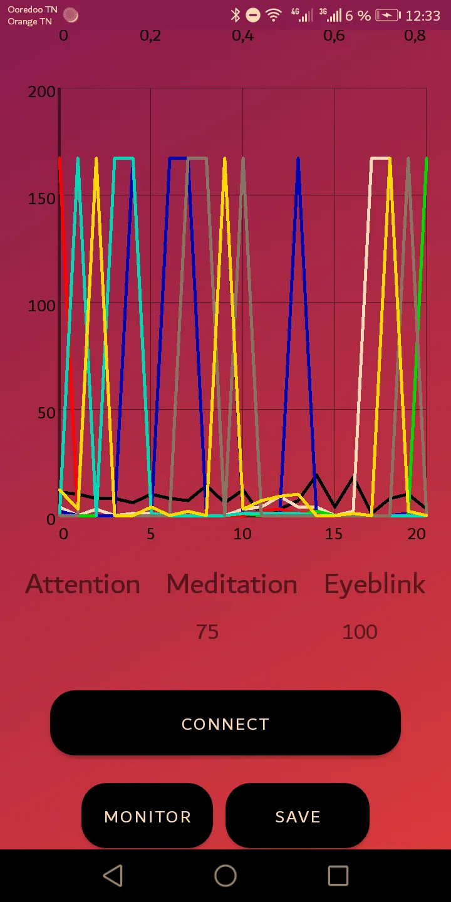

# Neuroskywaves

## Description

Neurosky waves is an app that connects with neurosky Mindwave mobile via bluetooth then starts to get data such as delta,alpha  
eyeblinks,meditation,attention,heartbeats and other waves.  
then displays those waves into graphs and you can also save the data into a backend (i used backendless) with a csv format.

## Getting Started

### Dependencies

* Android Kitkat

### Installing

* Clone this project
* Run/build this project into android that has kitkat+

## License

This project is licensed under the GNU General Public License v3.0 - see the LICENSE.md file for details

## Acknowledgments

* [Neurosky sdk](https://github.com/pwittchen/neurosky-android-sdk)
* [Graphview](https://github.com/jjoe64/GraphView)
## Pictures
 
